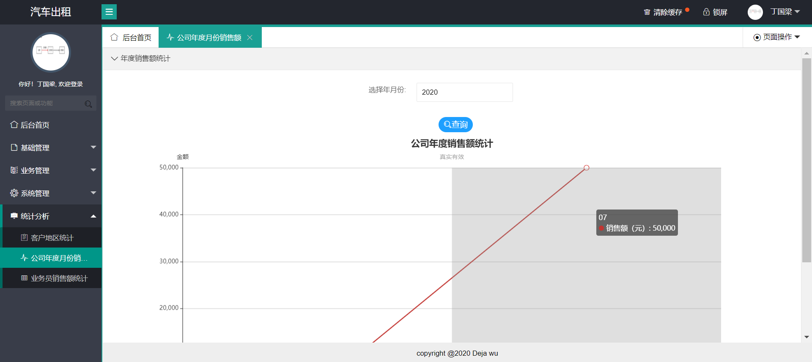

## :car::business_suit_levitating::sparkles: a simple carRent Manager system , created by SSM framework ~

### 项目概述  (:speech_balloon: pause update)

:+1:*一个基于SSM框架的汽车租聘管理系统*

:key:*数据库中默认的管理员身份信息 : 账户名 : `admin` , 密码 `123456`*


### 开发环境

| 工具    | 版本或描述                |
| ------- | ------------------------ |
| `OS`    | Windows 10               |
| `JDK`   |  1.8                     |
| `IDE`   | IntelliJ IDEA 2020.1.1 |
| `Maven` | 3.6.1                   |
| `MySQL` | 5.7.21             |


### 技术选型

#### 前端技术选型

- LayUI、dtree、echarts

#### 后端技术选型

- SSM

#### 所使用的模板

- https://gitee.com/layuicms/layuicms2.0


### 用户权限介绍

本项目使用的RBAC权限管理

- 用户表中type字段值为1的是超级管理员

- 用户表中type字段值为2的是普通用户

超级管理员可以给所有用户分配角色，且可以设置角色拥有哪些权限


### 项目结构

```

├─.idea
│  ├─artifacts
│  ├─dataSources
│  │  └─36bb06e9-877b-4ccd-816b-6e31654dafa6
│  │      └─storage_v2
│  │          └─_src_
│  │              └─schema
│  └─httpRequests
├─carRent项目截图
├─config
├─src
│  ├─main
│  │  ├─java
│  │  │  └─com
│  │  │      └─study
│  │  │          ├─constant
│  │  │          ├─controller
│  │  │          │  ├─bus
│  │  │          │  ├─stat
│  │  │          │  └─sys
│  │  │          ├─generator
│  │  │          ├─listener
│  │  │          ├─mapper
│  │  │          │  ├─bus
│  │  │          │  ├─stat
│  │  │          │  └─sys
│  │  │          ├─pojo
│  │  │          │  ├─bus
│  │  │          │  ├─stat
│  │  │          │  └─sys
│  │  │          ├─service
│  │  │          │  ├─bus
│  │  │          │  │  └─imp
│  │  │          │  ├─stat
│  │  │          │  │  └─imp
│  │  │          │  └─sys
│  │  │          │      └─imp
│  │  │          ├─task
│  │  │          ├─utils
│  │  │          │  ├─bus
│  │  │          │  ├─stat
│  │  │          │  └─sys
│  │  │          └─vo
│  │  │              ├─bus
│  │  │              └─sys
│  │  └─resources
│  │      └─properties
│  └─test
│      └─java
└─web
    ├─resources
    │  ├─css
    │  ├─echarts
    │  │  └─js
    │  ├─images
    │  ├─js
    │  ├─json
    │  ├─layui
    │  │  ├─css
    │  │  │  └─modules
    │  │  │      ├─laydate
    │  │  │      │  └─default
    │  │  │      └─layer
    │  │  │          └─default
    │  │  ├─font
    │  │  ├─images
    │  │  │  └─face
    │  │  └─lay
    │  │      └─modules
    │  ├─layui_ext
    │  │  ├─dist
    │  │  ├─dtree
    │  │  │  └─font
    │  │  └─json
    │  │      └─case
    │  └─page
    │      ├─doc
    │      ├─img
    │      ├─login
    │      ├─news
    │      ├─systemSetting
    │      └─user
    └─WEB-INF
        └─view
            ├─business
            │  ├─car
            │  ├─check
            │  ├─customer
            │  └─rent
            ├─stat
            └─system
                ├─loginInfo
                ├─main
                ├─menu
                ├─news
                ├─role
                └─user
```

#### 项目文件说明-`数据库文件`

```
car_rent.sql
```

#### 项目文件说明-`数据库配置信息`

```
db.properties
```

#### 项目文件说明-`LayUi 前端框架`

```
layui
```

#### 项目文件说明-`dtree 组件`

```
layui_ext
```

#### 项目文件说明-`echarts 组件`

```
echarts
```

#### 项目文件说明-`Spring 核心配置文件`

```
applicationContext.xml
```

#### 项目文件说明-`Spring MVC 核心配置文件`
```
spring-mvc.xml
```

#### 项目文件说明-`service 核心配置文件`
```
spring-service.xml
```

#### 项目文件说明-`MyBatis 核心配置文件`

```
mybatis-config.xml
```

#### 项目文件说明-`mybatis-generator 核心配置文件`

```
config/
```

#### 项目文件说明-`mybatis-generator 启动类`

```
GeneratorSqlMapper.java
```

#### 项目文件说明-`Mapper 接口映射文件`
```
mapper/
```

#### 项目文件说明-`出租单导出-二维码内嵌图`
```
logo.jpg
```


### 项目疑点解答

#### 1、用户与客户

​	此项目是给汽车租聘公司使用的后台管理系统，用户是公司内部人员，客户是顾客。


#### 2、图片上传和下载

​	车辆图片与用户图片地址都存在数据库相应的表格中，其中默认图片需要自己创建，默认图片地址参数在constant类中


### 项目截图

#### 1、关于用户的页面

- 用户登录页面


- 系统主页


- 锁屏


- 个人资料


- 修改密码


- 查看公告


#### 2、系统管理

- 菜单管理


- 角色管理


- 用户管理


- 日志管理


- 系统公告


- 数据源监控


#### 3、基础管理

- 客户管理


- 车辆管理


#### 4、业务管理

- 汽车出租


- 出租单管理


- 汽车入库


- 检查单管理


#### 5、统计分析

- 客户地区统计


- 公司年度销售额统计



- 业务员销售额统计


